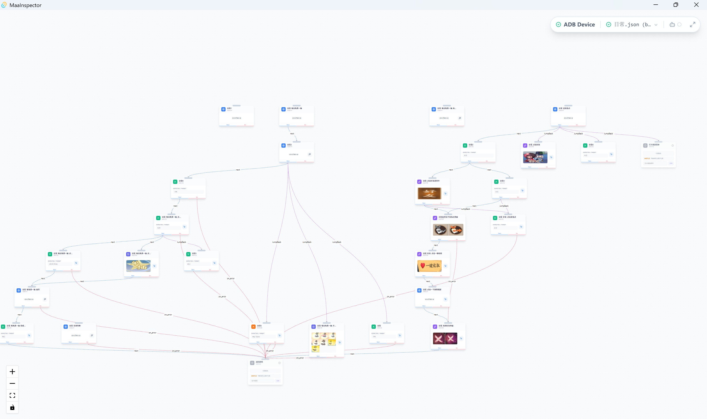
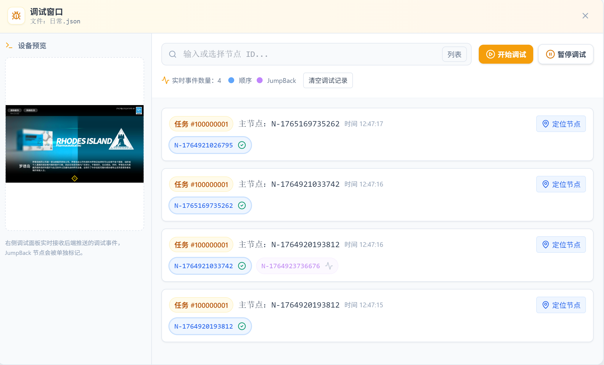
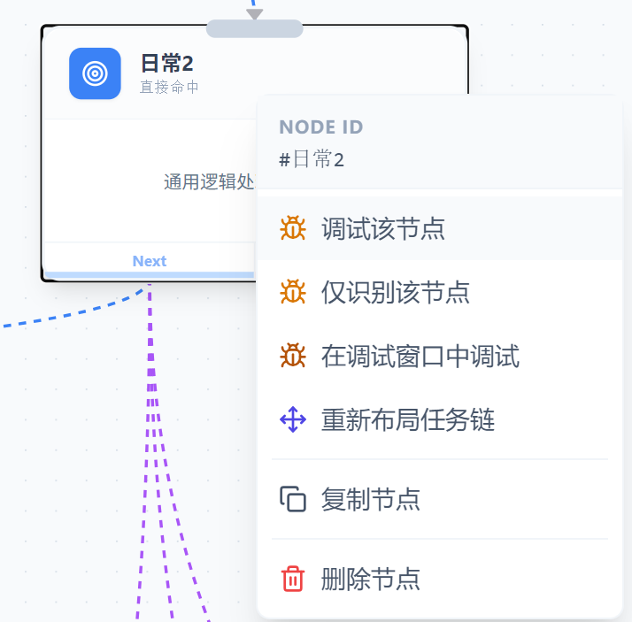

# MaaInspector

**MaaInspector** 是为 [MaaFramework](https://github.com/MaaXYZ/MaaFramework) 打造的可视化节点编辑器，旨在提供直观的图形化、低代码工作流创建与调试体验。

> 项目仍在开发中，功能持续完善中。  
⚠️ 重要提示
当前版本 仅支持 MaaFramework 5.0 及以上版本的 Pipeline。
旧版 Pipeline（4.x 及更早）暂不兼容。
---

## 功能特性

* **可视化拖拽编辑**：以图形化方式构建 `maafw` 工作流

* **内置运行与调试**：实时查看节点执行状态

* **节点属性面板**：双击节点即可编辑参数
* **画布增强体验**：缩放、平移、小地图等工具辅助管理大型流程
* **自动布局算法**：保持流程结构清晰可读
* **基于 Tauri**：轻量、高性能，目前支持 **Windows**
* **无需复杂环境即可直接运行体验版**

---

## 下载与快速体验

1. 前往仓库 **Releases** 页面下载最新版本。
2. Windows 用户直接安装并运行。
3. 若无法启动，请确保程序路径 **无中文/空格**，并查看发布页面的 **已知问题**。

> 单纯使用/体验 **无需安装 Node.js、Rust、Python** 等开发依赖。

---

## 使用指南（基础操作）

* **双击节点**：打开节点属性面板

* **右键节点**：调试节点、查看任务链

* **右键画布背景**：打开画布菜单，添加新节点

---

# 开发与构建（仅开发者需要）

如果你计划参与开发或自行构建，请按照以下步骤准备环境并运行开发模式。

## 环境要求

| 组件               | 说明                                      |
| ---------------- | --------------------------------------- |
| **Node.js**      | 前端开发环境                                  |
| **Rust / Cargo** | Tauri 构建环境（⚠️ 必须安装）                     |
| **Python 3**     | 后端服务环境                                  |
| **Tauri CLI**    | 构建 Tauri 所需 (`cargo install tauri-cli`) |

### 安装 Rust / Cargo（Tauri 必须）

请先确保你的 PC 已安装完整 Rust 工具链：

```bash
# 官方推荐（包含 Cargo）
curl --proto '=https' --tlsv1.2 -sSf https://sh.rustup.rs | sh
```

安装后请确认：

```bash
rustc --version
cargo --version
```

### 安装 Tauri CLI（如未安装）

```bash
cargo install tauri-cli
```

---

## 开发步骤

### **1) 克隆仓库**

```bash
git clone https://github.com/your-username/MaaInspector.git
cd MaaInspector
```

### **2) 安装前端依赖**

```bash
npm install
```

### **3) 安装后端依赖**

```bash
pip install -r backend/requirements.txt
```

### **4) 启动开发环境**

> ⚠️ 需确保 Rust / Cargo 已安装，否则 Tauri 无法运行。

```bash
npm run tauri dev
```

### **5) 构建安装包**

```bash
npm run tauri build
```

---

## 项目结构

```
.
├── backend/            # Python Flask 后端
│   ├── app.py
│   └── requirements.txt
├── src/                # Vue 3 前端源码
│   ├── components/
│   ├── App.vue
│   └── main.ts
├── src-tauri/          # Tauri Rust 核心
│   ├── Cargo.toml
│   └── src/
│       └── main.rs
├── package.json        # 前端依赖与脚本
└── README.md
```

