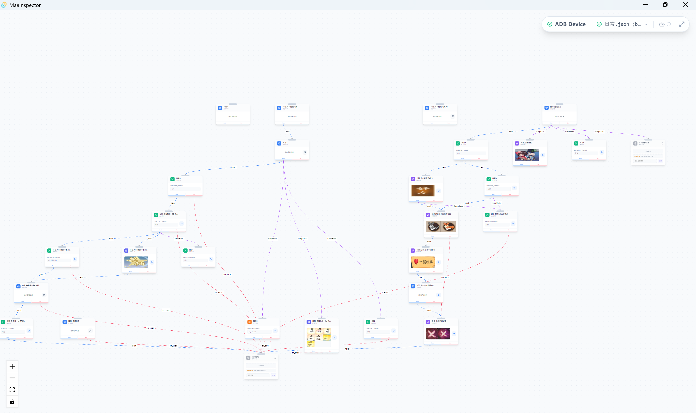
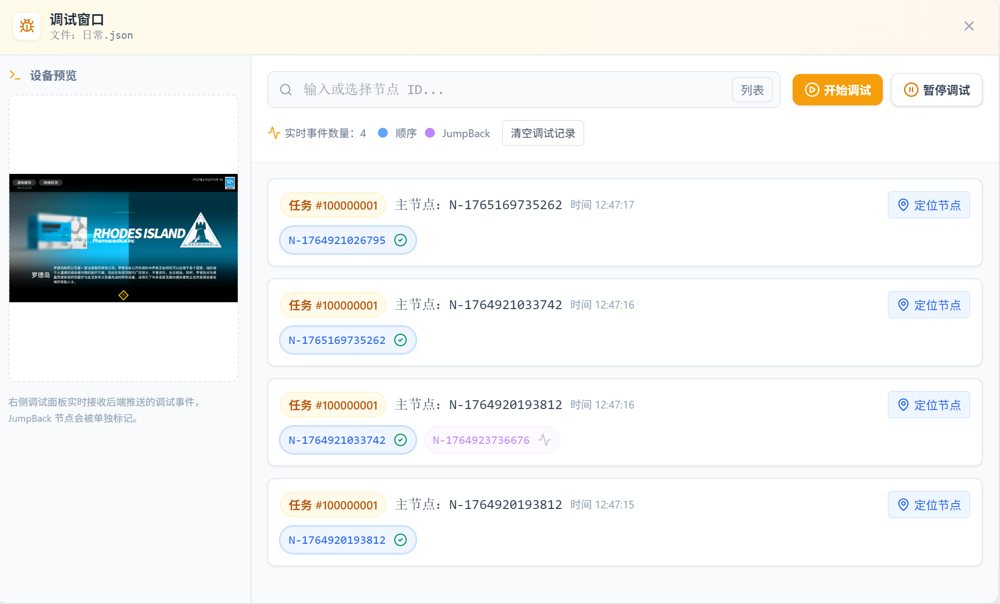
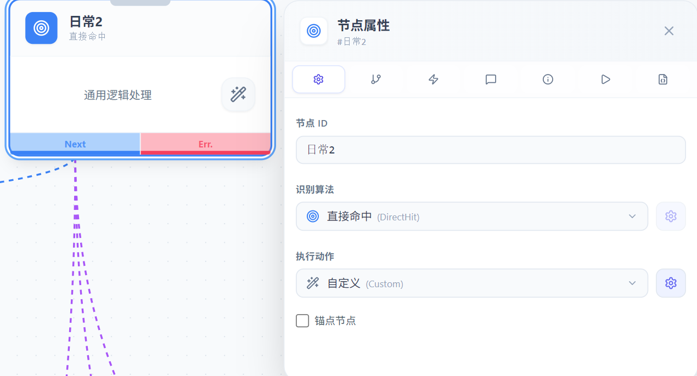
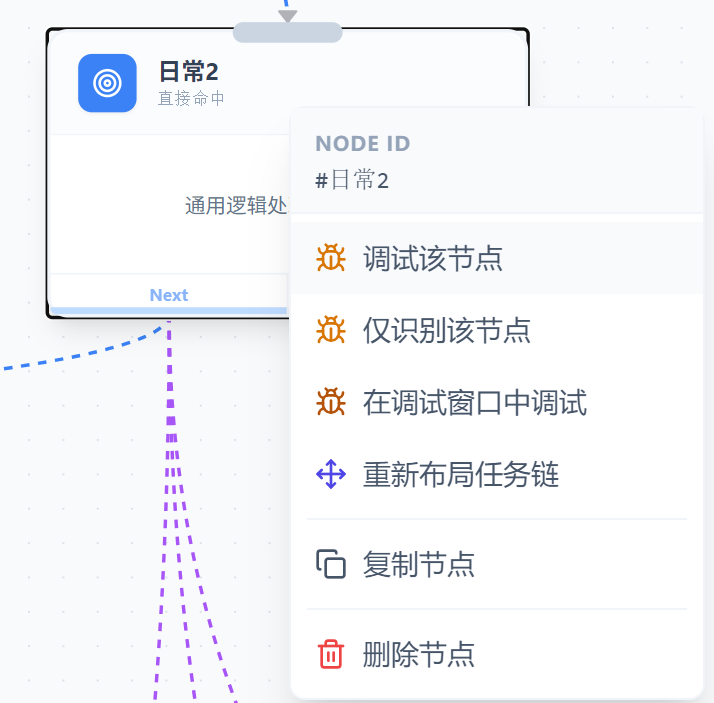

# MaaInspector

**MaaInspector** 是为 [MaaFramework](https://github.com/MaaXYZ/MaaFramework) 打造的可视化节点编辑器，旨在提供直观的图形化、低代码工作流创建与调试体验。

> 项目仍在开发中，功能持续完善中。  
⚠️ 重要提示
当前版本 仅支持 MaaFramework 5.0 及以上版本的 Pipeline。
旧版 Pipeline（4.x 及更早）暂不兼容。
---

## 功能特性

* **可视化拖拽编辑**：以图形化方式构建 `maafw` 工作流

* **内置运行与调试**：实时查看节点执行状态

* **节点属性面板**：双击节点即可编辑参数
* **画布增强体验**：缩放、平移、小地图等工具辅助管理大型流程
* **自动布局算法**：保持流程结构清晰可读
* **基于 Tauri**：轻量、高性能，目前支持 **Windows**
* **无需复杂环境即可直接运行体验版**

---

## 下载与快速体验

1. 前往仓库 **Releases** 页面下载最新版本。
2. Windows 用户直接安装并运行。
3. 若无法启动，请确保程序路径 **无中文/空格**，并查看发布页面的 **已知问题**。

> 单纯使用/体验 **无需安装 Node.js、Rust、Python** 等开发依赖。

---

## 使用指南（基础操作）

* **双击节点**：打开节点属性面板

* **右键节点**：调试节点、查看任务链

* **右键画布背景**：打开画布菜单，添加新节点

---

# 开发与构建（仅开发者需要）

如果你计划参与开发或自行构建，请按照以下步骤准备环境并运行开发模式。

## 环境要求

| 组件               | 说明                                      |
| ---------------- | --------------------------------------- |
| **Node.js**      | 前端开发环境 (推荐 v18+)                        |
| **pnpm**         | 包管理器                                    |
| **Rust / Cargo** | Tauri 构建环境（⚠️ 必须安装）                     |
| **Tauri CLI**    | 构建 Tauri 所需 (`cargo install tauri-cli`) |

### 安装 Rust / Cargo（Tauri 必须）

请先确保你的 PC 已安装完整 Rust 工具链：

```bash
# 官方推荐（包含 Cargo）
curl --proto '=https' --tlsv1.2 -sSf https://sh.rustup.rs | sh
```

安装后请确认：

```bash
rustc --version
cargo --version
```

### 安装 Tauri CLI（如未安装）

```bash
cargo install tauri-cli
```

---

## 开发步骤

### **1) 克隆仓库**

```bash
git clone https://github.com/your-username/MaaInspector.git
cd MaaInspector
```

### **2) 安装依赖**

```powershell
pnpm install
```

### **3) 启动开发环境**

> ⚠️ 需确保 Rust / Cargo 已安装，否则 Tauri 无法运行。

```powershell
pnpm tauri:dev
```

### **4) 构建安装包**

```powershell
pnpm tauri:build
```

### 软件更新与发布

桌面端使用 Tauri Updater 从 GitHub Releases 获取更新。推送 `v*` tag 后，
`.github/workflows/tauri-build.yml` 会自动完成版本同步、Windows NSIS 构建、更新包签名，
并把安装包、签名文件与 `latest.json` 上传到对应 Release。应用会验证更新签名后才允许安装。

> 首个包含 Updater 的版本需要用户从 Releases 手动安装一次；旧版本本身不具备更新能力。
> 从该版本开始，后续版本即可在应用内完成检查、下载、验签、安装与重启。

发布新版本：

```powershell
git tag v0.1.5
git push origin v0.1.5
```

签名私钥和密码分别保存在 GitHub Actions Secret `TAURI_SIGNING_PRIVATE_KEY_BASE64`、
`TAURI_SIGNING_PRIVATE_KEY_PASSWORD` 中；客户端公钥在 `src-tauri/tauri.conf.json`。
本机生成的私钥位于被 Git 忽略的 `.tauri/maainspector.key`。请把私钥和密码一起放到安全的
密码管理器或离线介质中备份。任一项丢失后，已安装的客户端都无法验证后续更新，不能通过简单生成
新密钥恢复。

需要为新的 fork 配置更新时，请生成独立密钥并写入该 fork 的 Secret：

```powershell
$passwordBytes = New-Object byte[] 32
[Security.Cryptography.RandomNumberGenerator]::Fill($passwordBytes)
$password = [Convert]::ToBase64String($passwordBytes).Replace('+', '-').Replace('/', '_').TrimEnd('=')
.\node_modules\.bin\tauri.cmd signer generate --ci --force --password $password --write-keys .tauri\maainspector.key

$keyBase64 = [Convert]::ToBase64String([IO.File]::ReadAllBytes((Resolve-Path '.tauri\maainspector.key')))
gh secret set TAURI_SIGNING_PRIVATE_KEY_BASE64 --body $keyBase64
gh secret set TAURI_SIGNING_PRIVATE_KEY_PASSWORD --body $password
```

随后把 `.tauri/maainspector.key.pub` 的完整内容更新到 `tauri.conf.json` 的
`plugins.updater.pubkey`，并把 endpoint 改成该 fork 的 Releases 地址。

---

## 项目结构

```
.
├── src/                # Vue 3 + TypeScript 前端源码
│   ├── components/     # Vue 组件
│   ├── services/       # 业务服务层
│   ├── utils/          # 工具函数
│   ├── __tests__/      # Vitest 测试文件
│   ├── App.vue         # 根组件
│   └── main.ts         # 入口文件
├── src-tauri/          # Tauri Rust 核心
│   ├── Cargo.toml
│   └── src/
│       └── main.rs
├── public/             # 静态资源
├── package.json        # 前端依赖与脚本
└── README.md
```

---

## 测试

项目使用 [Vitest](https://vitest.dev/) 作为测试框架，测试文件位于 `src/__tests__/`。

```powershell
# 运行一次测试
pnpm test

# 监听模式（开发时自动重跑）
pnpm test:watch
```

测试匹配 `src/**/*.{test,spec}.{js,ts}` 文件，运行环境为 `jsdom`。

---

## 贡献指南

欢迎贡献代码、报告问题或提出建议！

1. **Fork** 本仓库并创建你的特性分支
2. 遵循现有代码风格（2 空格缩进、`PascalCase` 组件名、`camelCase` 函数/变量）
3. 为新功能或修复添加相应的测试
4. 提交信息使用约定式前缀：`feat:`、`fix:`、`test:`、`chore:` 等
5. 提交 **Pull Request** 并描述变更内容与验证步骤

详细规范请参阅 [AGENTS.md](AGENTS.md)。
